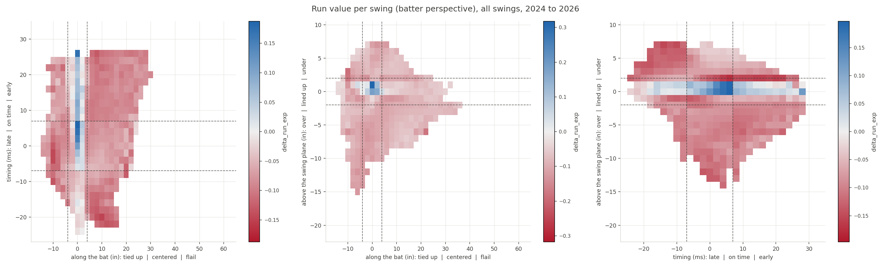

# Reconstructing Baseball Savant's swing timing and contact point

Baseball Savant's [Swing Timing / Miss Distance leaderboard](https://baseballsavant.mlb.com/leaderboard/bat-tracking/swing-timing-miss-distance)
scores every tracked swing on three axes and publishes only the season rates:

| axis | units | categories |
|---|---|---|
| x, where on the bat | inches | tied up / centered / flail |
| y, timing | milliseconds | late / on time / early |
| z, relative to the swing plane | inches | over / lined up / under |

The per-swing values are not published. This repo reconstructs them from public
Statcast fields, validates the result against Savant's own aggregates on two
held-out seasons, and maps run value over the reconstructed contact point.



## What it gets right

Category rates per player, mean absolute error against Savant's leaderboard.
2025 is the fit season; 2024 and 2026 were never used for fitting.

| season | pitcher rates | r | batter rates | r |
|---|---|---|---|---|
| 2024 (holdout) | 0.0203 | 0.876 | 0.0369 | 0.662 |
| 2025 (fit) | 0.0205 | 0.861 | 0.0359 | 0.677 |
| 2026 (holdout) | 0.0209 | 0.864 | 0.0369 | 0.663 |

Split by contact type, every one of the eight published cells lands within
0.003 of Savant.

## The main finding: timing is recoverable exactly

Savant's timing axis is not a closest-approach or bat-path quantity. It is
contact **depth**, expressed in milliseconds of ball flight:

```
y = 0.92 * (intercept depth in inches / ball speed in inches per ms) - 18
```

Zero sits about 27 inches in front of the batter reference point. Fit on
21,328 labeled swings, this reaches r-squared 0.951 with a slope of 1.00 and
agrees with Savant's own category label on 91.4 percent of swings. It applies
to every swing, contact or whiff, with no outcome term.

The other two axes are modeled rather than recovered, because Statcast
publishes the intercept point's lateral offset and depth but never its height.
See [docs/design.md](docs/design.md) for what each axis can and cannot reach.

## How the ground truth was obtained

Savant exposes per-swing values for a thin slice of swings through two
undocumented endpoints, both of which require the array form `season[]=YYYY`:

- Per-player histograms over all swings:
  `/leaderboard/bat-tracking/swing-timing-distribution/player/{id}`
- The ten worst whiffs per list, with signed per-swing x, y and z:
  `/leaderboard/services/swing-timing?id={id}`

That second one is the only per-swing ground truth that exists. It is a biased
sample by construction, so the code carries inverse-selection weights
throughout. `cp_lib/savant_truth.py` fetches and caches both; nothing is
re-fetched once cached.

## Layout

| path | what it is |
|---|---|
| `cp_lib/pull.py` | pulls one season of swings from a Statcast table to parquet |
| `cp_lib/savant_truth.py` | fetches and caches Savant's leaderboards, histograms and tails |
| `cp_lib/geometry.py` | pitch trajectory, bat frame, candidate features |
| `cp_lib/discover.py` | the ladder that searches for each axis's definition |
| `cp_lib/reconstruct.py` | the three routes that produce a per-swing value |
| `cp_lib/calibrate.py` | per contact type quantile maps onto Savant's distribution |
| `cp_lib/validate.py` | the scorecard against Savant's aggregates |
| `cp_lib/plots.py` | heatmaps and the validation figures |
| `contact_point.ipynb` | the executed notebook, all of the above end to end |
| `figures/` | every figure the notebook produces |
| `docs/design.md` | the design, including what is out of reach and why |

## Running it

The notebook needs a Statcast pitch-by-pitch source. `cp_lib/pull.py` reads a
PostgreSQL table named `savant_data` using `SUPABASE_DB_*` environment
variables; point it at your own copy, or replace that one module with any
loader that returns the columns it names. Neither the pulled rows nor the
cached Savant responses are redistributed here.

```bash
pip install -r requirements.txt
python -m cp_lib.pull --seasons 2024 2025 2026
python -m cp_lib.savant_truth fetch --seasons 2024 2025 2026
python build_notebook.py
pytest tests/ -q
```

The scrape is throttled at about one request per second and runs roughly three
thousand requests per season, so budget an hour per season the first time.

## Caveats worth reading before you use this

- **The contact point on a contact swing is partly a function of the outcome.**
  It is recovered by inverting exit velocity against a ceiling, so the
  hardest-hit balls pile up at exactly zero and carry their run value with
  them. Savant's value comes from bat tracking and is blind to the outcome.
  Run value per bin is therefore sharper at zero here than in Savant's version.
- **Per-player rates are compressed toward the league mean.** Per-swing error
  widens every player's distribution, which pulls the regression slope against
  Savant below 1. Correcting it was measured and refused: with correlations of
  0.66 to 0.92, the compressed estimate is the lower-error one.
- **Bunts are excluded and foul tips count as whiffs.** Both match Savant's own
  counting, verified against its published swing totals rather than assumed.
