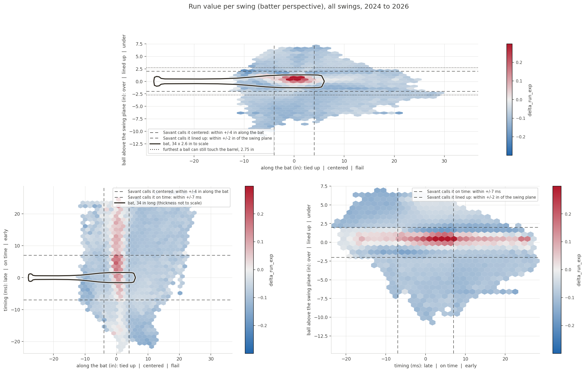
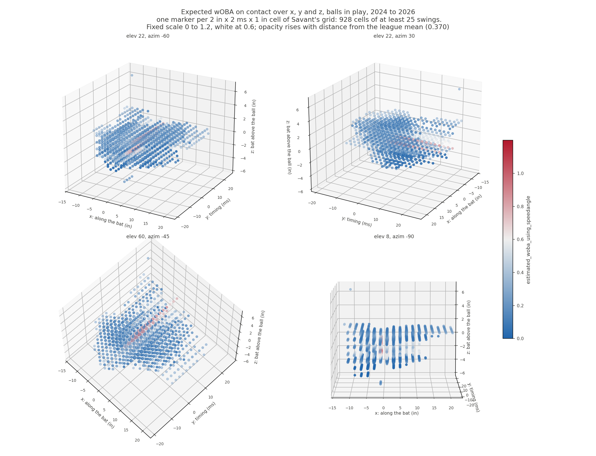

# Reconstructing Baseball Savant's swing timing and contact point

Savant's swing timing is contact depth. Take how far in front of the batter the
ball was met, divide by how fast the ball was travelling, and that is the number:

```
timing_ms = 0.92 * (intercept depth in inches / ball speed in inches per ms) - 18
```

That reproduces Savant's own per-swing value at r-squared 0.951 with a slope of
1.00 (n=21,328 labeled swings), and lands on its published category for 91.4% of
them. Zero sits about 27 inches in front of the batter reference point. It is not
a closest-approach quantity, not a bat-path quantity, and it carries no term for
what happened to the pitch.



Every figure draws expected wOBA on one fixed scale, 0 to 1.2 with white at
0.600, and run value on -0.3 to 0.3 with white at zero, blue cold and red hot.
A scale fitted to each panel's own data makes a quiet panel and a violent one
look alike, and nothing carries from one figure to the next.

Every axis is drawn on Savant's own sign. On z that means UNDER is positive,
which reads backwards until you notice that the number and the label describe
different objects: the number is the ball's height above the swing plane, and
the label is what the bat did. A ball above the plane means the bat passed under
it. Savant's 2025 leaderboard publishes avg_z_over = -3.78 and avg_z_under =
+2.99, and every one of their 11,476 per-swing rows labelled Over carries a
negative value under both batter hands.

Tied up is negative for all 1,826 of Savant's own tail rows under both hands,
because it measures handle against tip along the bat and does not care which
side of the plate the batter stands on.

Because x is inches along the bat, the two panels that carry x have a 34 inch
bat outlined over the hexagons, with its sweet spot at zero. That is where exit
velocity actually peaks: 100.3 mph at x = +0.5, falling to 87 by 2.5 inches either way and 75 by
6. The tip lands at +6 and the knob at -28.

On the x/z panel both axes are inches, so the bat is drawn in true inches on
both and the panel is held to equal aspect. That makes the outline checkable: a
ball touches the barrel while its centre is within 2.75 inches of the bat's
axis, and 98.5% of balls in play fall inside that line against 76.8% of fouls
and 53.9% of whiffs. Nothing in the reconstruction was ever told a bat exists,
so putting nearly every ball in play within reach of one is an independent check
on it. It also shows why under beats over: the red core sits inside the barrel
and slightly above the bat's centre line, which is the bat meeting the underside
of the ball.

The x/y panel cannot be locked to inches, because milliseconds are not a
thickness, so its bat keeps the x scale and takes its height from the panel's
own aspect. The y/z panel carries no bat at all: neither of its axes runs along
one, so the silhouette would have been decoration. Every line each panel draws
is named in that panel's own legend, with the number it sits at, so a Savant
threshold is never confused with the barrel's reach.

The overlay earns its space by showing that x is not symmetric. Nothing reaches
the knob, with 0.0% of swings below -28 and a 1st percentile of only -8.5, while
8.6% of balls in play and 32.8% of whiffs land past the tip. Contact cannot work
further down the bat than the hands, but a swing can miss by any distance off
the end, and that is the entire flail tail. The empty half of the panel is the
finding, not wasted space.

The best contact on balls in play is made about three quarters of an inch UNDER
the ball, not over it, and the gap is not close: one inch under is worth .584 in
expected wOBA against .179 one inch over. Launch angle is the mechanism and it
runs monotonically through zero.

| z | | expected wOBA | launch angle | exit velocity |
|---|---|---|---|---|
| +1.25 | under | .392 | +32 deg | 90.0 |
| +0.75 | under | .679 | +22 deg | 93.7 |
| 0 | lined up | .553 | +8 deg | 94.7 |
| -0.75 | over | .251 | -6 deg | 91.2 |
| -1.25 | over | .119 | -17 deg | 85.8 |

Getting under the ball lifts it, which is why "under" carries a positive launch
angle. Getting over it puts the ball in the ground. There is no symmetric
counterpart because there is no ideal ground ball, and that asymmetry is the
single largest feature of all three figures.

Only one of the three z bands pays. A swing more than 2 inches off its own
plane almost never puts the ball in play: 1.4% of "over" swings and 3.4% of
"under" ones do, against 59% of lined-up swings. Run value per swing follows,
at -0.095 over, +0.012 lined up and -0.080 under, on 313,326 swings in 2025.



Drawn against all three axes at once, the good contact is a tilted ridge rather
than a point: a batter meeting the ball early can still square it by catching it
at a different place along the bat. The 2D panels cannot show that, because each
of them averages one axis away.

Savant's [Swing Timing / Miss Distance leaderboard](https://baseballsavant.mlb.com/leaderboard/bat-tracking/swing-timing-miss-distance)
scores every tracked swing on three axes and publishes only the season rates:

| axis | units | categories |
|---|---|---|
| x, where on the bat | inches | tied up / centered / flail |
| y, timing | milliseconds | late / on time / early |
| z, relative to the swing plane | inches | over / lined up / under |

This repo reconstructs all three per swing from public Statcast fields, scores
the result against Savant's own aggregates on two held-out seasons, and maps run
value over the reconstructed contact point.

## Results

Per-player category rates, mean absolute error against Savant's leaderboard.
2025 is the fit season. 2024 and 2026 were never used for fitting.

| season | pitcher rates | r | batter rates | r |
|---|---|---|---|---|
| 2024 (holdout) | 0.0203 | 0.876 | 0.0369 | 0.662 |
| 2025 (fit) | 0.0205 | 0.861 | 0.0359 | 0.677 |
| 2026 (holdout) | 0.0209 | 0.864 | 0.0369 | 0.663 |

Split by contact type, all eight published cells land within 0.003 of Savant.
The holdout seasons do not sag against the fit season, which is the test that
matters.

Timing is the only axis recovered outright. The contact point (x) reaches
r-squared 0.712 and the swing plane (z) 0.665, both modeled rather than derived,
because Statcast publishes the intercept point's lateral offset and depth but
never its height. That missing height is the single largest constraint on this
work. [docs/design.md](docs/design.md) has the per-axis detail.

## Method

Three routes produce a contact point, chosen by what happened to the swing
(2025 counts, n=329,040 swings):

| route | swings | how |
|---|---|---|
| exit velocity inversion | 228,531 (69%) | invert the shortfall below the collision model's ceiling |
| whiff model | 84,413 (26%) | gradient boosting on Savant's labeled whiff tails, 80 features |
| geometry fit | 16,085 (5%) | linear fit by batter handedness, for fouls with no exit velocity |

All three then pass through a quantile map, fit per contact type, onto Savant's
published distribution. That map is what puts the routes on one scale.

## Ground truth

Savant exposes per-swing values for a thin slice of swings through two
undocumented endpoints. Both require the array form `season[]=YYYY`; the scalar
form is ignored and silently returns the current season.

- Per-player histograms over all swings:
  `/leaderboard/bat-tracking/swing-timing-distribution/player/{id}`
- The ten worst whiffs per list, with signed per-swing x, y and z:
  `/leaderboard/services/swing-timing?id={id}`

That second endpoint is the only per-swing ground truth that exists. It is a
biased sample by construction (the ten worst, per list, per player), so the code
carries inverse-selection weights throughout. `cp_lib/savant_truth.py` fetches
and caches both, and never re-fetches what it already has.

Two counting rules were verified against Savant's published swing totals rather
than assumed. Bunts are excluded, which matches Savant's per-player counts to a
median 0.2% on the pitcher side. Foul tips count as whiffs, which moves the whiff
rate from 0.2346 to 0.2565 against Savant's published 0.2569.

## Layout

| path | contents |
|---|---|
| `cp_lib/pull.py` | pulls one season of swings from a Statcast table to parquet |
| `cp_lib/savant_truth.py` | fetches and caches Savant's leaderboards, histograms and tails |
| `cp_lib/geometry.py` | pitch trajectory, bat frame, candidate features |
| `cp_lib/discover.py` | the ladder that searches for each axis's definition |
| `cp_lib/reconstruct.py` | the three routes above |
| `cp_lib/calibrate.py` | the per contact type quantile maps |
| `cp_lib/validate.py` | the scorecard against Savant's aggregates |
| `cp_lib/plots.py` | hexbins, the 3D cloud, and validation figures |
| `contact_point.ipynb` | the executed notebook, all of the above end to end |
| `figures/` | every figure the notebook produces |
| `docs/design.md` | the design, including what is out of reach and why |

## Running it

`cp_lib/pull.py` reads a PostgreSQL table named `savant_data` through
`SUPABASE_DB_*` environment variables. Point it at your own copy of Statcast
pitch-by-pitch, or replace that one module with any loader returning the columns
it names. Neither the pulled rows nor the cached Savant responses are
redistributed here.

```bash
pip install -r requirements.txt
python -m cp_lib.pull --seasons 2024 2025 2026
python -m cp_lib.savant_truth fetch --seasons 2024 2025 2026
python build_notebook.py
pytest tests/ -q
```

`contact_point.ipynb` is generated, so edit `build_notebook.py` and rebuild
rather than editing the notebook: every cell lives in that script as a string,
and a direct edit is overwritten by the next build. It runs papermill twice on
purpose, because the scorecard cell sits at the top and reads a file the last
cell writes, then strips the embedded figures so the committed notebook keeps
its tables and printed output while the PNGs ship separately in `figures/`.

The scrape throttles to about one request per second and runs roughly 3,000
requests per season, so budget an hour per season on the first run. Seven tests
skip without the cached data; the other 127 run standalone.

## Limits

**The contact point on a contact swing is partly a function of the outcome.** It
comes from inverting exit velocity against a ceiling, so every ball struck at or
above that ceiling lands at exactly zero: 6,055 swings in 2025, and by
construction the hardest-hit balls in the league. They drag that bin's mean run
value to +0.082 against Savant's +0.021. Savant's value comes from bat tracking
and is blind to the outcome, so its zero bin holds centered swings that produced
weak results too.

**Per-player rates compress toward the league mean.** Per-swing error widens each
player's distribution, which pulls the regression slope against Savant below 1
(pitcher lined up 0.724, batter lined up 0.604). Correcting it was measured and
refused: stretching the rates until the slope is 1 raises error on all six views
(pitcher lined up 0.0362 to 0.0401), because with correlations of 0.66 to 0.92
the compressed estimate is the lower-error one. A slope below 1 is what a noisy
estimate should do. `calibrate.apply_reliability` implements the correction and
is tested; nothing calls it.

**Batters score worse than pitchers on every axis.** A pitcher's season rate
averages over a couple hundred different batters, so each batter's personal error
in stance and bat height cancels. A batter's rate is the same batter every time,
and that offset never cancels.
